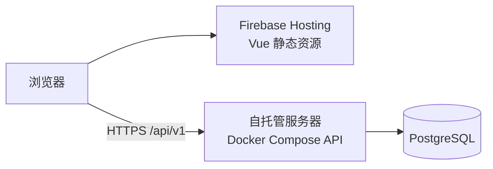
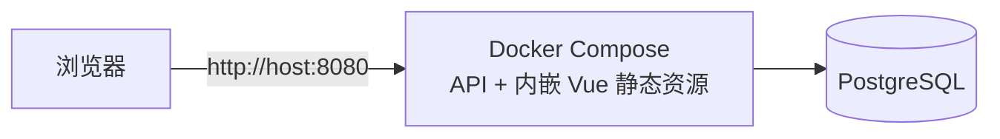

# 架构与运维

本文档说明 autotest 的系统架构、配置与环境变量、部署方案及运维约定。业务需求索引见 [requirements.md](../requirements.md)；各业务专题设计见同目录下其他 `*.md`。

## 系统架构

```
┌──────────────────────────────────────────────────────────────┐
│                        Frontend (Vue 3)                      │
│  ┌──────────┐ ┌──────────┐ ┌──────────┐ ┌──────────────────┐ │
│  │ Projects │ │Requests  │ │Scenarios │ │  Spec Import     │ │
│  │ Services │ │Templates │ │  Runner  │ │  Mock / RBAC     │ │
│  └──────────┘ └──────────┘ └──────────┘ └──────────────────┘ │
└──────────────────────────┬───────────────────────────────────┘
                           │ /api/v1/*
┌──────────────────────────┴───────────────────────────────────┐
│                       Backend (Go)                           │
│  ┌─────────────────────────────────────────────────────────┐ │
│  │                    HTTP Layer (Gin)                     │ │
│  │   auth middleware · JWT · RBAC permission check         │ │
│  └─────────────────────────┬───────────────────────────────┘ │
│                            │                                 │
│  ┌──────────┐ ┌──────────┐ ┌──────────┐ ┌──────────────────┐ │
│  │   spec   │ │ request  │ │ scenario │ │   mockserver     │ │
│  │ importer │ │ template │ │  runner  │ │  matcher/runtime │ │
│  └────┬─────┘ └────┬─────┘ └────┬─────┘ └────┬─────────────┘ │
│       │            │            │             │              │
│  ┌────┴────────────┴────────────┴─────────────┴────────────┐ │
│  │              Shared Services & Utils                    │ │
│  │  httpx · assertion · sampler · generator · paramsource  │ │
│  │  aiprovider · scriptlibrary · projectprompt · report    │ │
│  └──────────────────────────┬──────────────────────────────┘ │
│                             │                                │
│  ┌──────────────────────────┴──────────────────────────────┐ │
│  │                    Store (PostgreSQL)                   │ │
│  └─────────────────────────────────────────────────────────┘ │
└──────────────────────────────────────────────────────────────┘
```

前端为 Vue 3 管理后台；后端为 Go API（Gin），持久化使用 PostgreSQL。**默认生产形态**为 Firebase Hosting 托管前端 + 自托管 API（`deploy/prod`）；本地开发用 Vite dev server；All-in-One 单镜像仅为可选的便捷部署方式。

## 部署方案选择

| 场景 | 方案 | 章节 |
|------|------|------|
| **生产 / 线上（默认）** | Firebase 前端 + 自托管 Docker API | [生产部署](#生产部署) |
| 本地前后端分离开发 | `make run-api` + `make web-dev` | 根目录 [README.md](../../README.md) |
| 快速试用、内网演示（可选） | All-in-One 单镜像 | [All-in-One（可选）](#all-in-one可选) |

### deploy/ 目录结构

`deploy/` 目录仅保留 Docker 编排与镜像构建文件（Dockerfile、docker-compose、`.env.example`）。

```
deploy/
├── prod/                    # 默认生产：API-only + Firebase 前端
│   ├── Dockerfile
│   ├── docker-compose.yml
│   └── .env.example
└── all-in-one/              # 可选：单镜像一体栈（快速试用）
    ├── Dockerfile           # embedadmin 多阶段构建
    ├── docker-compose.yml
    └── .env.example
```

根目录 `Makefile` 提供 `firebase-deploy`、`docker-buildx` 等生产相关目标；API 栈使用 `deploy/prod` 的 docker compose；`all-in-one-up` 仅用于可选的一体栈试用。

### 方案对比

| 项 | Firebase + 自托管（默认） | All-in-One（可选） |
|----|---------------------------|-------------------|
| 用途 | 生产分离部署 | 快速试用、内网演示 |
| 前端托管 | Firebase Hosting | API 内嵌（`embedadmin`） |
| 镜像 | `deploy/prod/Dockerfile` + Firebase 静态前端 | `deploy/all-in-one/Dockerfile` |
| CORS | 环境变量 `CORS_ALLOWED_ORIGINS` | 同域，无需配置 |
| API 地址 | `VITE_API_BASE_URL` + `/api/v1` | 相对 `/api/v1` |
| OAuth 回调 | API 域名回调，跳转 Firebase 前端 | 与访问 URL 同域 |

## 配置与环境

### 核心原则

1. **一个维度只表达一件事**
   - `APP_ENV`：应用运行环境（development / test / staging / production）
   - `DB_MANAGED`：Makefile / Docker Compose **工具变量**，决定 compose 是否启动内置 PostgreSQL（profile `bundled-db`）；**Go 运行时不会读取**
   - `embedadmin` build tag：仅 All-in-One 可选镜像使用；默认生产 API 镜像（`deploy/prod`）不内嵌前端

2. **配置只解析一次** — 启动时由 `internal/config.Load()` 读取，各业务包通过注入使用，不在包内散落 `os.Getenv`。

3. **`.env` 是本地便利，不是部署方案** — 仅非 production 环境由 API 自动加载；生产环境只认注入的环境变量。

4. **数据库连接只用 `POSTGRES_*`** — Go 运行时通过 `POSTGRES_*` 组装 `DatabaseURL`；**不读取** `DATABASE_URL` 环境变量。`DATABASE_URL` 仅由 `scripts/build-database-url.sh` 在 Make / migrate / psql / compose 工具链中派生。

### 环境标识 APP_ENV

| 值 | 用途 | 典型触发 |
|----|------|----------|
| `development` | 本地开发 | `make run-api`、Docker dev 栈 |
| `test` | 单元 / 集成 / e2e 测试 | `make test`、`APP_ENV=test` |
| `staging` | 预发（可选） | 部署时显式设置 |
| `production` | 线上 | `docker compose`（`deploy/prod`）、外部编排 |

#### 别名（`internal/config` 归一化）

| 输入 | 归一化为 |
|------|----------|
| `dev`、`local`、`development` | `development` |
| `test`、`testing` | `test` |
| `stage`、`staging` | `staging` |
| `prod`、`production` | `production` |

未识别的值会原样保留（小写 trim 后），但建议使用上表 canonical 值。

#### 各环境默认行为

| 行为 | development | test | staging / production |
|------|-------------|------|----------------------|
| 自动加载 `.env` | 是 | 是 | 否 |
| CORS `*`（`EnableDevCORS`） | 是 | 否 | 否 |
| 非 development CORS 白名单 | 不启用（走 `*`） | `CORS_ALLOWED_ORIGINS` | `CORS_ALLOWED_ORIGINS` |
| 默认日志级别 | debug | warn | info |
| 默认日志格式 | text | text | json |
| 启动校验 secret | 否 | 否 | 是 |

CORS 由 `auth.CORSMiddleware` 统一处理（`cmd/api/main.go`）：

1. **`development`**：`EnableDevCORS()` 为真，响应 `Access-Control-Allow-Origin: *`。
2. **非 development**：白名单 **仅**来自环境变量 `CORS_ALLOWED_ORIGINS`（逗号分隔，去尾斜杠）。请求 `Origin` 在白名单内才回写 `Access-Control-Allow-Origin`。
3. OAuth 登录时的 `frontendUrl` 校验使用**当前登录方式**的 `trustedFrontendOrigins`（与 CORS 无关）；`development` 额外内置 `http://localhost:5173`、`http://127.0.0.1:5173`、`http://localhost:8080`、`http://127.0.0.1:8080`。

业务语义见 [管理后台与访问控制 — 登录方式](admin-and-access.md)。

#### production 启动校验（fail-fast）

`APP_ENV=production` 时 `config.Load()` 调用 `validateProduction()`，任一失败则进程退出：

| 检查项 | 规则 |
|--------|------|
| 数据库 | `DatabaseURL` 非空 |
| 数据库密码 | 整组 `POSTGRES_*` 组装后的 URL **不得**与开发默认值相同（user/password/host/port/db/sslmode 均为默认） |
| JWT | `JWT_SECRET` 非空，且不得为 `autotest-dev-secret-change-me` |

> Compose 生产配置（`deploy/prod/docker-compose.yml`）在容器启动前还会用 `${VAR:?}` 强制 `JWT_SECRET`，与 Go 层校验互补。

### 配置加载顺序

```
进程环境变量  >  .env 文件（仅非 production，godotenv.Load）  >  代码内按 APP_ENV 的默认值
```

`make` 目标若 `include .env`，会把变量 export 到子进程；Go 进程仍会通过 `config.Load()` 再次统一解析。

#### 两层配置

| 层 | 消费者 | 典型变量 |
|----|--------|----------|
| Go 运行时 | `internal/config.Load()` → `cmd/api` | `APP_ENV`、`POSTGRES_*`、`JWT_SECRET`、`CORS_ALLOWED_ORIGINS`、日志 |
| 工具链 | 根目录 `Makefile`、`scripts/with-database-url.sh`、Docker Compose | `DB_MANAGED`、`API_PORT`、`IMAGE` / `AUTOTEST_IMAGE`、`DATABASE_URL`（派生） |

### 环境变量清单

#### 应用（Go 运行时）

| 变量 | 必填 | 默认值 | 说明 |
|------|------|--------|------|
| `APP_ENV` | 否 | `development` | 运行环境 |
| `ADDR` | 否 | `:8080` | API 监听地址 |
| `POSTGRES_USER` | 否 | `autotest` | 数据库用户名 |
| `POSTGRES_PASSWORD` | production 强密码 | `autotest` | 数据库密码 |
| `POSTGRES_HOST` | 否 | `localhost` | 数据库主机 |
| `POSTGRES_PORT` | 否 | `5432` | 数据库端口 |
| `POSTGRES_DB` | 否 | `autotest` | 数据库名 |
| `POSTGRES_SSLMODE` | 否 | `disable` | PostgreSQL sslmode |
| `JWT_SECRET` | production 必填 | `autotest-dev-secret-change-me` | JWT 签名 |
| `CORS_ALLOWED_ORIGINS` | 生产部署必填 | 空 | 逗号分隔的前端 Origin，作为浏览器跨域 API 的 CORS 白名单（与登录方式「可信前端域名」无关） |
| `LOG_LEVEL` | 否 | 按环境 | debug / info / warn / error |
| `LOG_FORMAT` | 否 | 按环境 | text / json |

OAuth 登录方式、回调 URL、`trustedFrontendOrigins` 在管理后台 **用户管理 → 登录方式** 配置，不进 Go 环境变量。详见 [管理后台与访问控制 — 登录方式](admin-and-access.md)。

#### 前端构建（Vite，不进 Go 运行时）

| 变量 | 必填 | 说明 |
|------|------|------|
| `VITE_API_BASE_URL` | 生产构建时 | API 根 URL（不含 `/api/v1`，由前端代码拼接）；见 `web/admin/.env.production.example` |

本地 `make web-dev` 在 `web/admin/.env.development` 配置 `VITE_API_BASE_URL=http://localhost:8080` 时**直连**后端 API（与生产分离部署一致）；未配置时回退为相对路径 `/api/v1` 走 Vite 代理。生产部署（Firebase + API）时在 `web/admin/.env.production` 中配置 `VITE_API_BASE_URL`；本地验证生产构建可用 `make web-build-prod`。

#### Makefile / Docker Compose（工具层）

| 变量 | 默认值 | 说明 |
|------|--------|------|
| `DB_MANAGED` | `external` | `external` 或 `docker`；`docker` 时 `make up` / `make all-in-one-up` 或生产 compose 激活 profile `bundled-db` |
| `POSTGRES_*` | 见 `.env.example` | 与 Go 运行时相同；Make/Compose 用同一组变量初始化 bundled-db 容器 |
| `API_PORT` | `8080` | 宿主机映射 API 端口 |
| `IMAGE` | `geekeryy/autotest:latest` | 多架构构建 / 推送使用的镜像名 |
| `AUTOTEST_IMAGE` | 同 `IMAGE` | compose `api` 服务使用的镜像名 |
| `VITE_API_BASE_URL` | 空 | 见 `web/admin/.env.production`；GitHub Actions 在 `npm run build` 步骤注入 |
| `PLATFORMS` | `linux/amd64,linux/arm64` | `make docker-buildx` 目标平台 |
| `BUILDX_BUILDER` | `autotest-builder` | buildx builder 名称 |

`DB_MANAGED=docker` 时，`.env` 中 `POSTGRES_HOST` 写 **localhost**（供 `make run-api` / `make migrate` 从宿主机连接）；`make all-in-one-up` 或生产 compose 经 `scripts/with-database-url.sh compose` 自动改写为 **postgres** 供 compose 网络内 API 使用，并用同一组 `POSTGRES_*` 初始化 bundled-db 容器。

#### 工具链派生（脚本写入子进程，Go 不读）

| 变量 | 来源 |
|------|------|
| `DATABASE_URL` | `scripts/build-database-url.sh` 由 `POSTGRES_*` 组装 |
| `PGUSER`、`PGPASSWORD`、`PGHOST`、`PGPORT`、`PGDATABASE` | 同上，供 `psql` 使用 |

### 构建 tag：embedadmin

| 构建方式 | embedadmin | 行为 |
|----------|------------|------|
| `go run ./cmd/api` / `deploy/prod/Dockerfile` | 否 | 仅 API；前端由 Vite dev server 或 Firebase Hosting 提供 |
| `deploy/all-in-one/Dockerfile` | 是（`-tags embedadmin`） | Vite 产物嵌入 `cmd/api/webdist`，单端口提供 SPA + API |

### 各路径的最小配置

#### 1. 本地开发（前后端分离）

```bash
cp .env.example .env
# APP_ENV=development
make init
make run-api          # 终端 1
make web-dev          # 终端 2 → http://localhost:5173
```

无本地 PostgreSQL 时，可仅启动 compose 内数据库：

```bash
DB_MANAGED=docker make up   # 使用 all-in-one compose 中的 postgres
make run-api
make web-dev
```

#### 2. 生产部署（Firebase 前端 + 自托管 API，默认）

前端部署 Firebase Hosting，后端与 PostgreSQL 在自有服务器 Docker 运行。详见 [生产部署](#生产部署)。

```bash
# 服务器（项目根目录）
cp deploy/prod/.env.example .env
# 配置 JWT_SECRET、POSTGRES_*、CORS_ALLOWED_ORIGINS
set -a && . ./.env && set +a
./scripts/with-database-url.sh compose -- COMPOSE_PROFILES=bundled-db \
  docker compose --project-directory deploy/prod -f deploy/prod/docker-compose.yml up -d --build

# 本地 / CI 发布前端
cp web/admin/.env.production.example web/admin/.env.production
# VITE_API_BASE_URL=https://api.example.com
make firebase-deploy
```

#### 3. 测试 / CI

单元测试（不依赖数据库）：

```bash
make test    # 内置 APP_ENV=test
```

集成测试（需 PostgreSQL，建议使用独立库 `autotest_test`）：

```bash
export APP_ENV=test
export POSTGRES_USER=autotest
export POSTGRES_PASSWORD=autotest
export POSTGRES_HOST=localhost
export POSTGRES_PORT=5432
export POSTGRES_DB=autotest_test
export POSTGRES_SSLMODE=disable
make test-integration
```

CI 应显式注入 `APP_ENV=test` 与 `POSTGRES_*`，不依赖仓库内的 `.env`。

#### 4. 生产式 Docker（外部 PostgreSQL）

```bash
# 项目根目录 .env：DB_MANAGED=external，POSTGRES_* 指向外部库（容器内可解析的主机名）
set -a && . ./.env && set +a
./scripts/with-database-url.sh compose -- \
  docker compose --project-directory deploy/prod -f deploy/prod/docker-compose.yml up -d --build
```

compose 仅启动 API 容器。

#### 5. 生产式 Docker（compose 内 PostgreSQL）

```bash
# 项目根目录 .env：DB_MANAGED=docker，POSTGRES_PASSWORD 含强密码
set -a && . ./.env && set +a
DB_MANAGED=docker ./scripts/with-database-url.sh compose -- COMPOSE_PROFILES=bundled-db \
  docker compose --project-directory deploy/prod -f deploy/prod/docker-compose.yml up -d --build
```

#### 6. All-in-One（可选，内嵌前端）

PostgreSQL + 内嵌管理后台 API，单端口访问，适合不想配置 Firebase 时的快速体验。详见 [All-in-One（可选）](#all-in-one可选)。

```bash
cp deploy/all-in-one/.env.example deploy/all-in-one/.env
make all-in-one-up
# 访问 http://localhost:8080
```

### 常用 Make 目标

| 目标 | 说明 |
|------|------|
| `init` / `migrate` | 数据库就绪 + 执行迁移 |
| `run-api` / `web-dev` | 本地前后端分离开发 |
| `web-build` / `web-build-prod` | 前端构建（development / production 模式） |
| `firebase-deploy` | `web-build-prod` + 部署到 Firebase Hosting（生产默认） |
| `docker-buildx` / `docker-buildx-push` | 多架构 API-only 镜像（`deploy/prod/Dockerfile`） |
| `all-in-one-up` / `all-in-one-down` | 可选一体栈（`deploy/all-in-one/.env`） |
| `test` / `test-integration` | 单元测试 / 集成测试 |

生产 API 栈使用 `deploy/prod` 的 docker compose（项目根目录 `.env`）；All-in-One 为可选，读取 `deploy/all-in-one/.env`。

### Docker Compose 文件

| 文件 | 用途 |
|------|------|
| `deploy/prod/docker-compose.yml` | **默认生产**：API-only + 可选 postgres（profile `bundled-db`） |
| `deploy/prod/Dockerfile` | API-only 镜像 |
| `deploy/all-in-one/docker-compose.yml` | 可选：内嵌前端 API + 可选 postgres |
| `deploy/all-in-one/Dockerfile` | embedadmin 多阶段镜像 |

```bash
# 生产 API + compose 内 postgres（项目根目录 .env 已配置）
set -a && . ./.env && set +a
DB_MANAGED=docker ./scripts/with-database-url.sh compose -- COMPOSE_PROFILES=bundled-db \
  docker compose --project-directory deploy/prod -f deploy/prod/docker-compose.yml up -d --build

# 生产 API + 外部 postgres
set -a && . ./.env && set +a
./scripts/with-database-url.sh compose -- \
  docker compose --project-directory deploy/prod -f deploy/prod/docker-compose.yml up -d --build

# All-in-One 可选试用（默认 bundled-db）
make all-in-one-up

# All-in-One + 外部 postgres
DB_MANAGED=external docker compose --project-directory deploy/all-in-one -f deploy/all-in-one/docker-compose.yml up -d
```

## 生产部署

**默认部署方式**：管理后台前端部署到 [Firebase Hosting](https://firebase.google.com/docs/hosting)，后端 API 与 PostgreSQL 通过 Docker Compose（`deploy/prod`）部署在你自己的服务器上。

### 架构



| 组件 | 部署位置 | 说明 |
|------|----------|------|
| 前端 `web/admin` | Firebase Hosting | SPA，`VITE_API_BASE_URL` 填 API 域名 |
| 后端 `cmd/api` | 自有服务器 Docker | 使用 `deploy/prod/Dockerfile`，不内嵌前端 |
| PostgreSQL | 同一 compose 栈或外部 | `DB_MANAGED=docker` 时 compose 内 postgres；`external` 时用 `POSTGRES_*` |

典型域名规划（示例）：

| 用途 | 域名 |
|------|------|
| 前端 | Firebase Hosting 默认域名或自定义域名 |
| API | `https://api.example.com` |
| OAuth 回调 | `https://api.example.com/api/v1/auth/oauth/{slug}/callback` |

> OAuth 回调必须注册在 **API 域名**上（保存登录方式时由 `VITE_API_BASE_URL` + slug 生成并写入 DB）；登录成功后后端 302 到 `{frontendUrl}/login/oauth/callback#token=...`（`frontendUrl` 来自登录请求，须在对应登录方式的「可信前端域名」内）。

### 一、后端（自有服务器）

#### 1. 准备环境变量

在服务器项目目录复制生产模板：

```bash
cp deploy/prod/.env.example .env
```

编辑 `.env`，至少设置：

```env
DB_MANAGED=docker          # docker：compose 内 postgres；external：仅 API + 外部 POSTGRES_*
POSTGRES_USER=autotest
POSTGRES_PASSWORD=strong-password
POSTGRES_HOST=localhost
POSTGRES_PORT=5432
POSTGRES_DB=autotest
POSTGRES_SSLMODE=disable
JWT_SECRET=...
# 前后端分离：浏览器跨域 CORS（Firebase 前端 Origin）
CORS_ALLOWED_ORIGINS=https://your-app.web.app
```

#### 2. 启动生产栈

```bash
set -a && . ./.env && set +a
./scripts/with-database-url.sh compose -- COMPOSE_PROFILES=bundled-db \
  docker compose --project-directory deploy/prod -f deploy/prod/docker-compose.yml up -d --build
```

`DB_MANAGED=external` 时去掉 `COMPOSE_PROFILES=bundled-db`，仅启动 `api`；需在 `.env` 设置容器可访问的 `POSTGRES_*`（例如 `POSTGRES_HOST=host.docker.internal`）。

`DB_MANAGED=docker` 时包含：

- `postgres`：持久化卷 `postgres-data`（compose profile `bundled-db`）
- `api`：`deploy/prod/Dockerfile` 构建的纯 API 镜像，启动时自动迁移

常用命令：

```bash
docker compose --project-directory deploy/prod -f deploy/prod/docker-compose.yml logs -f api
docker compose --project-directory deploy/prod --profile bundled-db -f deploy/prod/docker-compose.yml down
```

#### 3. 反向代理与 HTTPS（推荐）

Compose 默认暴露 `API_PORT`（8080）。生产环境建议在宿主机用 Nginx / Caddy 终结 TLS，反代到 `127.0.0.1:8080`。

最小 Nginx 示例：

```nginx
server {
    listen 443 ssl http2;
    server_name api.example.com;

    location / {
        proxy_pass http://127.0.0.1:8080;
        proxy_http_version 1.1;
        proxy_set_header Host $host;
        proxy_set_header X-Real-IP $remote_addr;
        proxy_set_header X-Forwarded-For $proxy_add_x_forwarded_for;
        proxy_set_header X-Forwarded-Proto $scheme;
        # SSE 长连接
        proxy_buffering off;
        proxy_read_timeout 3600s;
    }
}
```

#### 4. CORS

前后端分离时，浏览器从 Firebase 域名跨域访问 API。在 API 服务端配置环境变量 `CORS_ALLOWED_ORIGINS`（逗号分隔的前端 Origin）：

```env
CORS_ALLOWED_ORIGINS=https://your-app.web.app,https://admin.example.com
```

> **与 OAuth「可信前端域名」的区别**：`CORS_ALLOWED_ORIGINS` 控制浏览器能否跨域调用 API；登录方式里的「可信前端域名」仅校验 OAuth 成功后回跳到哪个前端地址（`frontendUrl`）。生产部署时两者通常填相同的前端 URL，但配置位置与用途不同。

### 二、前端（Firebase Hosting）

#### 1. 初始化 Firebase

```bash
cd web/admin
npm ci
cp .firebaserc.example .firebaserc   # 项目 geekeryy，Hosting site autotest-one
cp .env.production.example .env.production
# 本地首次部署需 firebase login；CI 使用 WIF，无需 login
```

`.env.production`：

```env
# 仅填 API 域名，路径前缀 /api/v1 由前端代码拼接
VITE_API_BASE_URL=https://api.example.com
```

#### 2. 构建与部署

在项目根目录：

```bash
make firebase-deploy
```

或分步：

```bash
make web-build-prod
cd web/admin && npm run deploy:hosting
```

`firebase.json` 已配置 SPA fallback（所有路径回退 `index.html`）。

#### 3. GitHub Actions 自动部署（Workload Identity Federation）

无需 service account JSON 密钥。GCP 侧一次性初始化：

```bash
GITHUB_REPO=geekeryy/autotest ./scripts/setup-firebase-github-wif.sh
```

脚本会创建 WIF Pool/Provider、专用 service account，并仅允许指定 GitHub 仓库 impersonate。

在 GitHub 仓库 **Settings → Secrets and variables → Actions → Variables** 配置：

| Variable | 示例值 |
|----------|--------|
| `GCP_PROJECT_ID` | `geekeryy` |
| `GCP_WORKLOAD_IDENTITY_PROVIDER` | `projects/123456789/locations/global/workloadIdentityPools/github-actions/providers/github` |
| `GCP_SERVICE_ACCOUNT` | `github-firebase-deploy@geekeryy.iam.gserviceaccount.com` |
| `VITE_API_BASE_URL` | `https://api.example.com`（仅域名） |

Workflow 见 `.github/workflows/firebase-hosting.yml`：推送到 `main` 且 `web/admin/**` 有变更时，先校验上述四个 Variable 均已配置，再 `npm run build` 注入 `VITE_API_BASE_URL`，最后 `npm run deploy:hosting` 部署到 `autotest-one`（target 由 `firebase.json` 指定，`https://autotest-one.web.app`）。也可在 Actions 页手动 **Run workflow**。

> 若组织策略禁止创建 JSON 密钥，`firebase init` 的 GitHub 集成会失败；请使用本 WIF 方案，不要用 `FIREBASE_SERVICE_ACCOUNT` secret。

#### 4. 自定义域名（可选）

在 Firebase Console → Hosting 绑定自定义域名后：
- **CORS**：将该域名加入 API 的 `CORS_ALLOWED_ORIGINS`
- **OAuth 回跳**：在对应登录方式的「可信前端域名」中配置该域名

### 三、OAuth 登录方式配置

**推荐**：登录管理后台 → **用户管理 → 登录方式**，配置 GitHub / GitLab / Google OAuth（Client ID/Secret、回调 URL 预览与持久化、**可信前端域名**（OAuth 回跳校验））。保存时前端根据 `VITE_API_BASE_URL` + slug 生成回调地址并写入 DB：

`{VITE_API_BASE_URL}/api/v1/auth/oauth/{slug}/callback`

前端构建示例：

```env
VITE_API_BASE_URL=https://api.example.com
```

在 IdP 控制台注册上述 DB 回调 URL（Homepage URL 填 Firebase 前端 URL）。GitLab 自建实例需在后台配置 `baseUrl`（如 `https://gitlab.company.com`），并在对应 GitLab 应用注册上述 DB 回调 URL。

### 四、首次登录

1. 访问 Firebase 前端 URL
2. 使用默认 `admin` / `admin` 登录
3. 按提示完成首次改密并重新登录

### 五、与本地开发的区别

| 项 | 本地开发 | Firebase + 自托管 |
|----|----------|-------------------|
| 前端 | Vite `:5173`，proxy `/api` | Firebase 静态托管 |
| 后端 | `make run-api` | Docker `deploy/prod/Dockerfile` |
| CORS | `*`（development） | `CORS_ALLOWED_ORIGINS` |
| API 地址 | 相对 `/api/v1` | `VITE_API_BASE_URL`（域名）+ 代码拼接 `/api/v1` |

### 相关文件

| 文件 | 说明 |
|------|------|
| `deploy/prod/Dockerfile` | API-only 镜像 |
| `deploy/prod/docker-compose.yml` | 生产 compose |
| `deploy/prod/.env.example` | 服务器环境变量模板 |
| `web/admin/.env.production.example` | 前端 API 地址 |
| `web/admin/firebase.json` | Firebase Hosting 配置 |
| `.github/workflows/firebase-hosting.yml` | GitHub Actions 部署（WIF） |
| `scripts/setup-firebase-github-wif.sh` | WIF 一次性初始化脚本 |

## All-in-One（可选）

单命令启动 **PostgreSQL + 内嵌管理后台的 API**，适合不想配置 Firebase、仅想快速体验完整平台时使用。非默认生产方案；线上请使用 [生产部署](#生产部署)。

### 架构



```
浏览器 → http://localhost:8080
           ├── 静态前端（Vue，内嵌于 API 镜像）
           └── /api/v1/* → Go API → PostgreSQL
```

| 组件 | 说明 |
|------|------|
| API | `deploy/all-in-one/Dockerfile` 构建，`-tags embedadmin` 内嵌 `web/admin` 构建产物 |
| PostgreSQL | `DB_MANAGED=docker` 时 compose profile `bundled-db` 启动 `postgres:16-alpine`，数据卷 `postgres-data` |
| 前端 | 与 API 同域同端口，浏览器请求 `/api/v1` 为相对路径 |

与 [生产部署](#生产部署) 不同，本方案前后端同域、同端口，无需配置 CORS 或 `VITE_API_BASE_URL`。

### 快速开始

```bash
cp deploy/all-in-one/.env.example deploy/all-in-one/.env
make all-in-one-up
```

浏览器打开 [http://localhost:8080](http://localhost:8080)，账号 `admin` / `admin`，首次登录须改密。

### 常用命令

```bash
docker compose --project-directory deploy/all-in-one -f deploy/all-in-one/docker-compose.yml logs -f api
make all-in-one-down
```

### 相关文件

| 文件 | 说明 |
|------|------|
| `deploy/all-in-one/docker-compose.yml` | 一体栈 compose |
| `deploy/all-in-one/.env.example` | 环境变量模板 |
| `deploy/all-in-one/Dockerfile` | embedadmin 多阶段镜像 |

## 相关模板文件

- 根目录 `.env.example`、`deploy/prod/.env.example`、`deploy/all-in-one/.env.example`
- 前端生产构建 `web/admin/.env.production.example`
